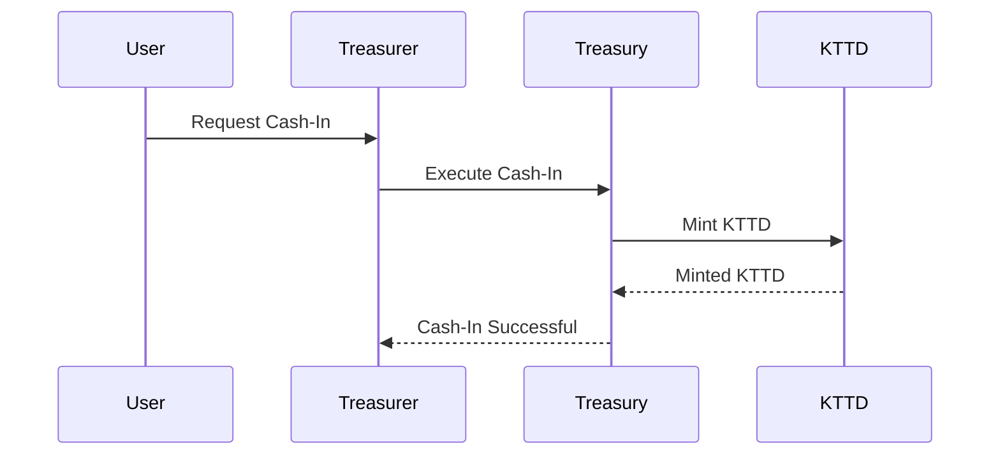
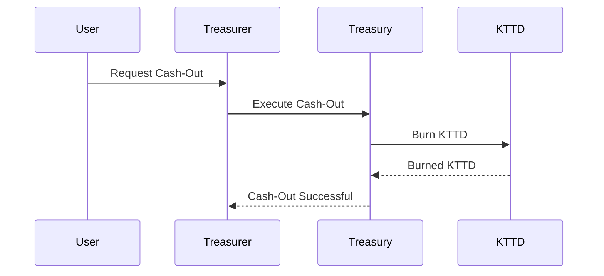

# Kolektivo Trinidad & Tobago Dollar Specification

## Overview

**Name**: Kolektivo Trinidad & Tobago Dollar

**Symbol**: KTTD

**Decimals**: Default (18)

## Token Standards

The standards used in this specification are **ERC20**, using the **OpenZeppelin Contracts** library, for the Kolektivo Trinidad & Tobago Dollar token. The faucet is implemented using custom logic, underpinned by the use of Roles assigned to specific addresses.

### Third Party Libraries

[Ownable](https://docs.openzeppelin.com/contracts/2.x/access-control#ownership-and-ownable) - OpenZeppelin Contracts

[Pausable](https://docs.openzeppelin.com/contracts/5.x/api/utils#Pausable) - OpenZeppelin Contracts

[Merkle-Proof](https://docs.openzeppelin.com/contracts/3.x/api/cryptography) - OpenZeppelin Contracts

## Roles

Since there only needs to be one role or a simple access control mechanism, the **Ownable** contract from OpenZeppelin may be used to assign the deployer of the contract as the owner.

## Contracts

| Contract | Description | Standard |
| --- | --- | --- |
| KTTD | Kolektivo Trinidad & Tobago Dollar token | ERC20 |
| Treasury | Manages the Cash-In and Cash-Out processes of the platform | Custom |

### Kolektivo Trinidad & Tobago Dollar

The Kolektivo Trinidad & Tobago Dollar token contract must have some concept of access control, either via using **Ownable** by OpenZeppelin Contracts, or by implementing a custom access control mechanism using roles. While an RBAC approach would be more verbose it is unnecessary overhead for this simple token.

```solidity
contract KTTD is ERC20, Ownable {
    constructor() ERC20("Kolektivo Trinidad & Tobago Dollar", "KTTD") {
        _mint(msg.sender, amount);
    }
}
```

> The **Ownable** contract assigns the deployer of the contract as the owner, and provides a modifier `onlyOwner` that can be used to restrict access to certain functions.

The Ownership of the token contract should be transferred after deployment to the Treasury contract so that the Treasury can manage the token supply.

### Treasury

The faucet contract must have some concept of access control, either via using **Ownable** by OpenZeppelin Contracts, or by implementing a custom access control mechanism using roles. While an RBAC approach would be more verbose it is unnecessary overhead for this simple faucet. We may also want to include a way to control whether the supply can be modified, or if the faucet can be paused, we can achieve this using the **Pausable** contract from OpenZeppelin Contracts.

Only Merchants may withdraw or cash-out from the protocol, as such a Merkle root will be used to maintain the list of Merchants that are allowed to cash-out. The Merkle root will be set by the Treasury contract and can only be updated by the Treasury contract.

```solidity
contract Treasury is Ownable, Pausable {
    IERC20 public token;
    bytes32 public merkleRoot;

    constructor(IERC20 _token, bytes32 _merkleRoot) {
        token = _token;
    }
}
```

> The **Ownable** contract assigns the deployer of the contract as the owner, and provides a modifier `onlyOwner` that can be used to restrict access to certain functions.

## Functions & Flows

The Cash-In and Cash-Out flows both are role restricted, meaning that the internal logic is dependent on being authorized by the Treasury. We can do this by leveraging a `EIP712 Typed Structs` (the digest) approach to sign the request and verify the signature. The digest is a hash signed by the Treasury's private key, and the signature is verified by the Treasury contract.

```ts
const Types = {
    CashIn: [
        { name: "user", type: "address" },
        { name: "amount", type: "uint256" },
        { name: "nonce", type: "uint256" }
    ],
    ...
}

const signature = sign(Domain, Types.CashIn, message)
```

```sh
user: address - The address of the account that wants to perform an action
amount: uint256 - The amount of kTTD that the action specifies
nonce: uint256 - A unique identifier or counter of all actions signed and executed by the Treasury
```

> This is just a rudimentary implementation.

```solidity
contract Treasury is Ownable {
    function cashIn(address user, uint256 amount, uint256 nonce, bytes memory signature) public {
        require(hasBeenSignedByTreasurer(user, amount, nonce, signature), "Invalid Signature");
        token.mint(user, amount);
    }

    function hasBeenSignedByTreasurer(address user, uint256 amount, uint256 nonce, bytes memory signature) public view returns (bool) {
        bytes32 digest = keccak256(abi.encodePacked("\x19\x01", Domain, keccak256(abi.encode(Types.CashIn, user, amount, nonce))));
        return ECDSA.recover(digest, signature) == owner();
    }
}
```

> This is just a rudimentary implementation.

### Cash-In



### Cash-Out



* Collapse treasury functions into ERC20 token contract
* Is it a transferrable token?
* use `mint` and `burn` on ERC20 instead of `cashIn` and `cashOut` on the treasury contract
